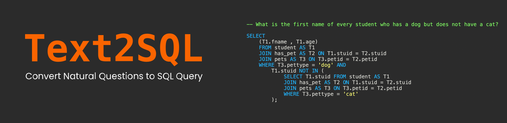
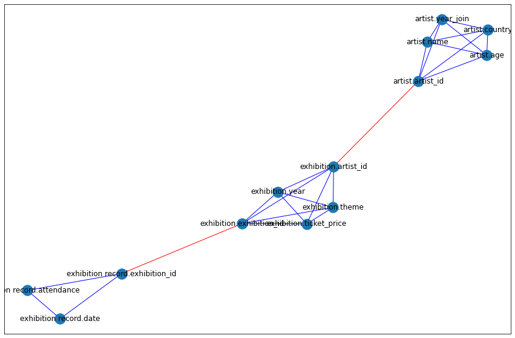

# Text2SQL

How many times have you pulled your hair apart writing a SQL query, now use natural language to convert to appropriate SQL and save your precious hair.

Though this can be used as a standalone package, I highly recommend that you use `streamlit` to play with the model interactively, to run it interactively
```
streamlit run t2s.py
```

## Installation

Run
```
pip install text2sql
```

To install make changes to this repo clone it then run `setup.py`
```
git clone https://github.com/yashbonde/text2sql.git
cd text2sql/
pip3 install -e . #text2sql
```

## Parsing

New method of parsing to convert each DB to a graph network, red denotes foreign keys.


## Trainer File

Simple trainer file.

## Datasets

Using [CoSQL](https://yale-lily.github.io/cosql), [Spider](https://yale-lily.github.io/spider), [Sparc](https://yale-lily.github.io/sparc) datasets, credit to the authors. There are a couple of things to note, we have in total 178 tables, but only 166 tables in training date and dev set has 20 tables.

We convert the dateset into graphs using `text2sql.data.parse_db_to_networkx()` function. 


## License

Following are the licensing things:
1. I am releasing my part of code under MIT License
2. `transformers` code is under Apache License, Version 2.0

